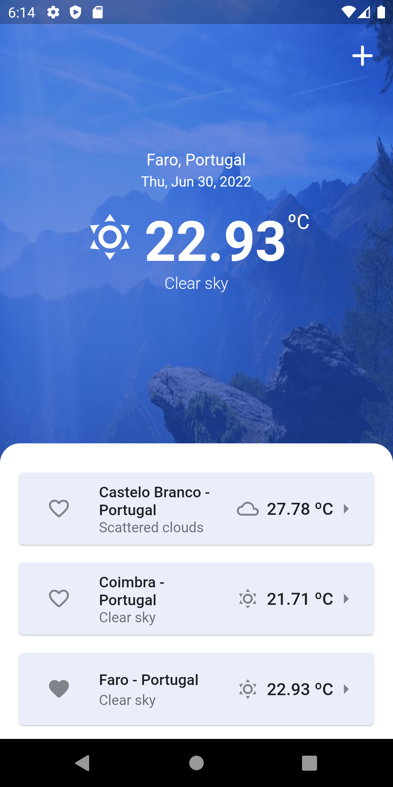

# Weather Application
A Weather Forecast Mobile App developed in Flutter

## Interface
Main Page | Manage Locations Page | City Page
--- | --- | ---
 |  | 

## Application Flow

- **Main Page**: From the Main Page it is possible to navigate to the Cities List and to the City Page. To visualize and manage the preferred cities, the user shall click on the “+” button in the superior right corner of the page. To visualize a certain city page, the user must click on the respective city card available at the bottom of the screen  
- **Manage Locations Page**: From this section, the user has only the option to navigate back to the main page, by clicking on the arrow button in the superior left corner of the screen.  
- **City Page**: As well as in the Manage Locations Page, from this page the user is only allowed to navigate back to the Main Page. 

## Contributors
- 
- 
- 
